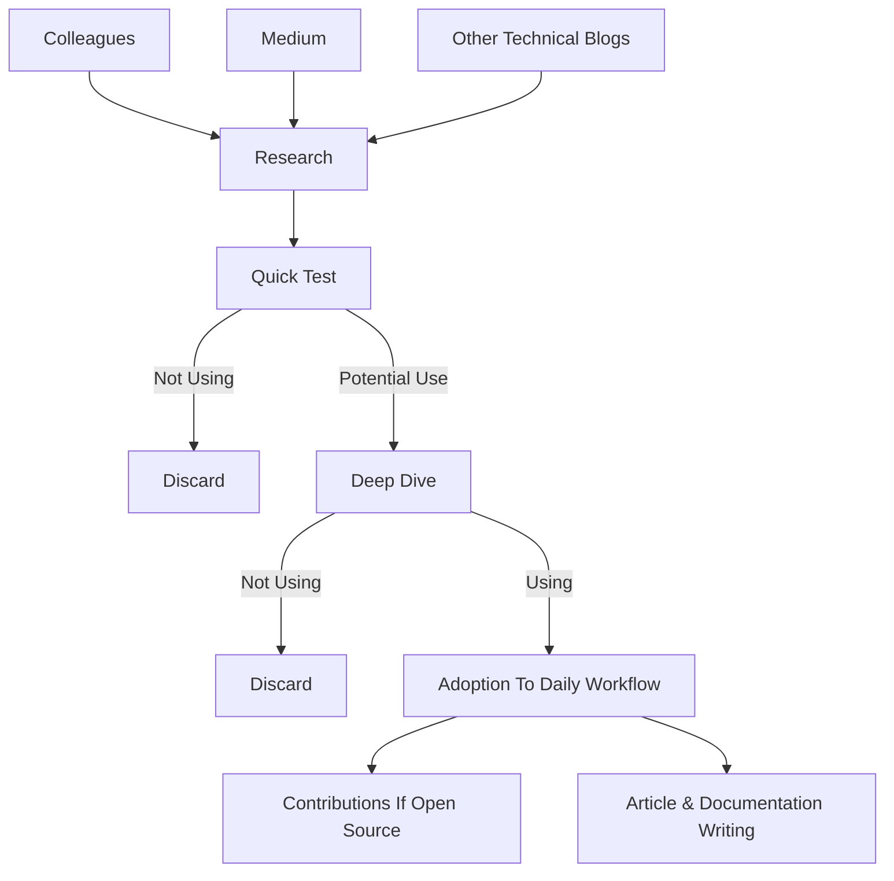
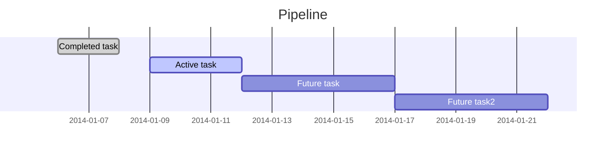

# About
Hi, I’m Pablo, a Chemical Engineer, Data Scientist and Linux enthusiast. I like to constantly learn new programming languages, bleeding-edge technologies and technical disciplines and write about them so that people get to know and potentially adopt them as seamlessly as possible.

I’m also passionate about literature, films, philosophy, aesthetics, art, fashion, design, natural sciences and scents.

# Table of Contents
- [Specialties](#specialties)
	- [Categories](#1-categories)
	- [Technologies](#2-technologies)
		- [Platforms](#21-platforms)
		- [Languages](#22-languages)
		- [IDEs, Editors & Environments](#23-ides-editors-environments--terminal-emulators)
		- [Visualization](#24-visualization)
		- [Version Control](#25-version-control)
		- [Productivity](#26-productivity)
		- [Graphic Design & Digital Asset Management](#27-others)
- [Index](#index)
	- [Blog](#blog)
	- [Deep Dives](#deep-dives)
	- [Guided Projects](#guided-projects)
	- [Portfolio](#portfolio)
	- [Documentation](#documentation)
	- [Showroom](#showroom)
	- [GitHub Gists](#github-gists)
- [Project Pipeline](#project-pipeline)
- [Get to Know Me](#get-to-know-me)

# Specialties
Most of my work is focused on Data Science, Data Engineering, Data Analysis, Probability Theory & Statistics & Computer Science. You can see a more detailed breakdown below:

## 1. Categories

            

You can also consult the [Category Sphere](https://pabloagn.com/categories/) for a full breakdown.

## 2. Technologies
I like to constantly test emerging and exciting technologies, althouth not everything I test makes it to my daily workflow; there are too many tools out there and it's easy to get lost. This is why I like to keep a well-defined pipeline, otherwise, this process would become endless.

Below are all the technologies I've adopted as daily drivers, although I ocassionaly use other tools to perform specific tasks:

### 2.1 Platforms
 

### 2.2 Languages
            

### 2.3 IDEs, Editors, Environments & Terminal Emulators
          

### 2.4 Visualization
 

### 2.5 Version Control
 

### 2.6 Productivity
   

### 2.7 Others
   

You can also consult the [Technology Sphere](https://pabloagn.com/technologies/) for a full breakdown.

# Index
Below is a complete index of all the material I have, including my personal website, GitHub repositories, GitHub Gists and a Project Showroom.

## Blog
Here you will find my collection of written articles and essays. Main topics are usually Statistics & Data Science oriented, but I may shift towards other tech-related subjects once in a while.

	

    &nbsp&nbsp
    

## Deep Dives
Here you will find my collection of articles related to specific modules, libraries, extensions and plugins.

Each article discusses one of the components above, and consists of a detailed explanation & main features, along with hands-on examples.

	

    &nbsp&nbsp
    

## Guided Projects
This section is about finding a cool project you’d like to replicate and getting your hands dirty.

Keep in mind that this section contains guided projects I design for educational purposes. You can head to the [Portfolio](https://pabloagn.com/portfolio/) section if you’d like to view my Project Portfolio. You can also visit my [showroom](https://pabloagn.github.io/), where I host a simpler index of my Guided Projects & Portfolio Projects.

Some projects are adaptations from existing ones, and others are my creations. Either way, the source is specified in each case, and credit is acknowledged where it’s due. Projects are classified by category/topic, difficulty, tech stack used, and approximate execution time. Also, suggested prerequisites are specified in case it applies.

	

    &nbsp&nbsp
    

## Portfolio
Here you will find a list of all my projects & collaborations. You’ll also find links for the corresponding repositories and project licenses on each project. Projects are ordered descending by publish date. The start date & end date refer to the actual project design & execution.

Keep in mind that this section refers to my personal portfolio; thus projects included are not explained step-by-step. If you’d like to build your own project using guidance, you can head to the [Guided Projects](https://pabloagn.com/guided-projects/) section. You can also visit my [showroom](https://pabloagn.github.io/), where I host a simpler index of my Guided Projects & Portfolio Projects.

	

    &nbsp&nbsp
    

## Documentation
Here you will find all the documentation I’ve created for the technology I use. I currently use Windows & Linux as main drivers, so most of the documentation will not be platform agnostic, though occasionally, I may include macOS-related content. Keep in mind that most cases are WIP. All documents are created using [Markdown](https://pabloagn.com/blog/what-is-markdown-and-why-is-it-useful/).

	

    &nbsp&nbsp
    

## Showroom
A portfolio showroom was created as a complement to my personal website. It's intended to provide a quick way to get to know my work.

	

    &nbsp&nbsp
    

## GitHub Gists
GitHub Gists are a quick and easy way to produce code snippets. I usually create gists for showcasing examples or as a way to archive relevant fragments of code that might turn in handy. 

	

    

# Project Pipeline
I always like to plan which projects I'm going to tackle next. Below you can find a Ghantt Diagram containing a pipeline.

# Get to Know Me

	

    &nbsp&nbsp
    

