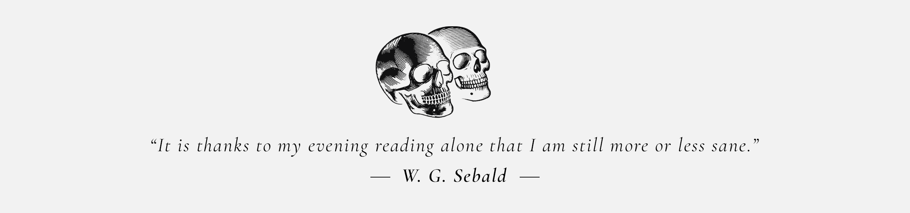

  <h1>Pablo Aguirre</h1>
  
Chemical Engineer │ M.Sc. Data Science │ NixOS Crackhead

 

───────  §  ───────

 

    When it comes to tech, there are three things I appreciate the most: Declarative configs, functional programming, & efficient code. I'm OK living my entire life doing these 3.

 

    

        

        &nbsp&nbsp
        &nbsp&nbsp
        
    

 

───────  §  ───────

 

## I. Core Technical Domains

<table>
  <tr>
    <th colspan="3"><b>Data Engineering & MLOps</b></th>
  </tr>
  <tr>
    <td><b>Architecture & Processing</b></td>
    <td><b>Storage & Infrastructure</b></td>
    <td><b>Operations & Delivery</b></td>
  </tr>
  <tr>
    <td><b>Spark</b> (Scala/Python), <b>Kafka</b>, Flink, <b>Airflow</b>/Dagster, ClickHouse, Databricks, dbt</td>
    <td>Lakehouse (Delta/Iceberg), Vector DBs (Qdrant, etc.), <b>Cloud</b> (AWS/Azure/GCP), IaC (<b>NixOS</b>, Terraform)</td>
    <td><b>Docker</b>, Kubernetes, Kubeflow, CI/CD for ML, GitOps, Feature Stores, Data Quality/Contracts, Observability, FastAPI</td>
  </tr>
</table>

<table>
  <tr>
    <th colspan="3"><b>Machine Learning & AI</b></th>
  </tr>
  <tr>
    <td><b>Modeling & Frameworks</b></td>
    <td><b>Specializations</b></td>
    <td><b>Methodology</b></td>
  </tr>
  <tr>
    <td><b>Python</b> (Pandas, NumPy, Scikit-learn, XGBoost), TensorFlow, PyTorch</td>
    <td>NLP (Transformers), GenAI (LangChain, LLMOps), Optimization, Bayesian Methods, Time Series Analysis, Causal Inference</td>
    <td>Experiment Tracking (MLflow, W&B), Versioning (DVC), Cloud ML Platforms (SageMaker, Azure ML, Vertex AI)</td>
  </tr>
</table>

<table>
  <tr>
    <th colspan="2"><b>Programming & Systems</b></th>
    <th colspan="2"><b>Databases & Visualization</b></th>
  </tr>
  <tr>
    <td><b>Languages</b></td>
    <td><b>Foundations</b></td>
    <td><b>Databases</b></td>
    <td><b>Visualization</b></td>
  </tr>
  <tr>
    <td><b>Python</b>, <b>Scala</b> (Functional), <b>Rust</b>, SQL, R, Haskell, Julia, Java, JS/TS, Bash/Zsh</td>
    <td>Linux Systems (NixOS), Distributed Systems Concepts, Software Design</td>
    <td>PostgreSQL, MySQL, MongoDB, Redis</td>
    <td>Power BI, Tableau, Superset, D3.js, React</td>
  </tr>
</table>

 

───────  §  ───────

 

## II. Projects

### II.I Dev Profiles

  <table cellspacing="0" cellpadding="0" border="0">
    <tr>
      <td width="33%" align="center" valign="top" style="padding: 20px;">
        

          
        

         
        

          Personal workspace: Core configurations, standalone projects, and experimental code
        

      </td>
      <td width="33%" align="center" valign="top" style="padding: 20px;">
        

          
        

         
        

          Repository organization for technical articles published on <a href="https://pabloagn.com">Sanctum Black</a>
        

      </td>
    </tr>
  </table>

### II.II Project Pipeline

| Project                                                                                                                                                                                                                                                                                                                                          | Description                                                                                                                                                                                                                                                                                                                                                                                                       | Key Technologies                                                                                                  |
| :----------------------------------------------------------------------------------------------------------------------------------------------------------------------------------------------------------------------------------------------------------------------------------------------------------------------------------------------- | :---------------------------------------------------------------------------------------------------------------------------------------------------------------------------------------------------------------------------------------------------------------------------------------------------------------------------------------------------------------------------------------------------------------- | :---------------------------------------------------------------------------------------------------------------- |
| **Phantom Suite**                                                                                                                   | A **12-module system** designed to build an **open, queryable repository** of **validated canonical works**, **countering disinformation** through **expert curation**. Employs a **robust data pipeline** (**NixOS/Docker** orchestration, **NLP/Sentence Transformers** processing, **PostgreSQL/Qdrant** storage) exposed via **FastAPI**, enabling **advanced textual analysis** and **knowledge discovery**. | **NixOS**, Docker, **Python**, FastAPI, PostgreSQL, **Qdrant**, **Sentence Transformers**, React, Celery, Airflow |
| **Rhodium**                                                                                                                         | **Modular, reproducible** NixOS configuration using **Flakes** and **Home Manager**, providing a **script-deployable** dev environment demonstrating **IaC practices**.                                                                                                                                                                                                                                           | **NixOS**, **Nix Flakes**, **Home Manager**, Shell Scripting, SOPS, CI/CD                                         |
| **Sentiment Analysis GUI**                               | **Desktop GUI application** enabling **customizable, bulk sentiment analysis**; integrated **multiple algorithms** (**NLTK**, **Transformers**) and **visualization options**.                                                                                                                                                                                                                                    | Python, **NLTK**, **Transformers**, Tkinter                                                                       |
| **Targeted Lung Cancer EDA**                                     | Focused **exploratory data analysis** on **lung cancer risk factors** to identify **key predictors** and **influential data patterns** using Python data science libraries.                                                                                                                                                                                                                                       | Python, **Pandas**, **Seaborn**, **Scikit-learn**                                                                 |
| **Sanctum Black Tech Blog**      | Technical blog focused on **practical implementations** in **Statistics**, **Programming**, and **Scientific Computing**; manage **CI/CD pipeline** for deployment.                                                                                                                                                                                                                                               | **Hugo**, **GitHub Actions**, Netlify, SCSS                                                                       |

 

───────  §  ───────

 

## III. Further Information

  <table border="0" cellspacing="0" cellpadding="0" width="80%">
    <tr>
      <td align="center" width="33%" style="padding: 20px;">
        
        
Portfolio & technical blog

      </td>
      <td align="center" width="33%" style="padding: 20px;">
        
        
Useful fragments and examples

      </td>
      <td align="center" width="33%" style="padding: 20px;">
        
        
Inquiries or collaboration opportunities

      </td>
    </tr>
  </table>

 

───────  §  ───────

 

 

  

